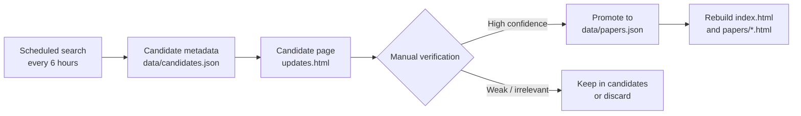

<div align="center">

# Acoustic–Optics Imaging Paper Tracker

**A curated, scheduled, and searchable literature tracker for acoustic–optical imaging, acoustic coded imaging, computational acoustics, sonar imaging, acoustic holography, and photoacoustic / acousto-optic imaging.**

[](https://github.com/ruixv/acoustic-optics-imaging/actions/workflows/update-papers.yml)
[](https://github.com/ruixv/acoustic-optics-imaging/actions/workflows/link-check.yml)


[Browse the tracker](./index.html) · [Latest candidates](./updates.html) · [Verified metadata](./data/papers.json) · [Scheduled update guide](./SCHEDULED_UPDATE.md)

</div>

---

## Why this repository exists

The literature around **sound, light, and computation** is scattered across physics journals, optics journals, graphics venues, vision conferences, biomedical imaging journals, and signal-processing venues. This repository keeps a compact, high-confidence tracker of papers that are especially relevant to:

- **Acoustic–optical sensor fusion**: camera–sonar fusion, acoustic–optical neural rendering, cross-modal reconstruction.
- **Acoustic coded imaging**: coded sound fields, computational acoustic sensing, acoustic masks, wave-based imaging.
- **Acoustic imaging and sonar**: synthetic aperture sonar, coherent reconstruction, acoustic NLOS, underwater 3D reconstruction.
- **Acoustic holography and sound-field control**: phased arrays, acoustic holograms, volumetric displays, computational fabrication.
- **Photoacoustic and acousto-optic imaging**: photoacoustic tomography, all-optical ultrasound detection, acousto-optic wavefront control.

The goal is not to collect every loosely related paper. The goal is to maintain a **small, accurate, updateable reading map** for top-tier work.

---

## Current snapshot

| Item | Status |
|---|---:|
| Verified papers | **21** |
| Year range | **2019–2026** |
| Main index | [`index.html`](./index.html) |
| Latest auto-discovered candidates | [`updates.html`](./updates.html) |
| Machine-readable paper database | [`data/papers.json`](./data/papers.json) |
| Auto-update interval | **Every 6 hours** |
| PDF policy | Open/legal sources only |

### Prioritized venues

This tracker prioritizes papers from:

| Category | Examples |
|---|---|
| Nature family | Nature, Nature Electronics, Nature Photonics, Nature Biomedical Engineering, Nature Communications, Communications Physics |
| Science family | Science, Science Advances, Science Robotics, Science Translational Medicine |
| Graphics | ACM TOG, SIGGRAPH, SIGGRAPH Asia |
| Vision / ML | CVPR, ICCV, ECCV, ICLR, NeurIPS |
| Imaging / pattern analysis | IEEE TPAMI, IEEE TIP, IEEE TCI, IEEE TMI |
| Physics / acoustics / optics | Optica, Light: Science & Applications, Physical Review family, JASA, IEEE TUFFC |

---

## Repository layout

```text
.
├── index.html                         # Searchable main paper index
├── updates.html                       # Auto-discovered candidate papers
├── data/
│   ├── papers.json                    # Manually verified paper database
│   ├── candidates.json                # Automatically collected candidates
│   ├── watchlist.json                 # Related directions to monitor
│   └── last_update.json               # Latest scheduled update metadata
├── papers/                            # One HTML page per verified paper
├── pdfs/                              # Open PDFs downloaded locally; ignored when unavailable
├── scripts/
│   ├── build_site.py                  # Rebuild HTML pages from JSON metadata
│   ├── update_candidates.py           # Scheduled candidate search and metadata refresh
│   ├── download_pdfs.py               # Download legal/open PDFs where possible
│   ├── check_links.py                 # Validate DOI / PDF / project / code links
│   └── search_candidates.py           # Manual search helper
├── .github/workflows/
│   ├── update-papers.yml              # Scheduled update every 6 hours
│   └── link-check.yml                 # Periodic link checking
├── SCHEDULED_UPDATE.md                # Automation and permission guide
└── GITHUB_SETUP.md                    # GitHub Pages and token setup
```

---

## Curation policy

A paper should be promoted from `data/candidates.json` to `data/papers.json` only if it satisfies all three criteria below.

### 1. Topical relevance

The paper must be directly related to at least one of the following:

- acoustic–optical or camera–sonar fusion;
- acoustic imaging, sonar imaging, synthetic aperture sonar, acoustic NLOS, or computational ultrasound;
- acoustic coded imaging, acoustic holography, programmable sound fields, or acoustic phased arrays;
- photoacoustic or acousto-optic imaging where both acoustic and optical physics are essential.

### 2. Source quality

Metadata should be verified from authoritative sources whenever possible:

- official publisher page;
- ACM / IEEE / Nature / Science / CVF / OpenReview page;
- arXiv page;
- institutional repository;
- official project page or author page.

### 3. Legal PDF availability

The PDF downloader only attempts open/legal sources, including:

- publisher open-access PDFs;
- arXiv;
- PMC / PubMed Central;
- CVF;
- institutional repositories;
- author-hosted PDFs.

Do **not** add paywall-bypass links, unofficial scraped PDFs, or links with unclear redistribution status.

---

## Update workflow

This repository uses a two-stage update model to avoid polluting the verified database with noisy search results.



The scheduled job updates **candidate papers** first. A paper enters the main tracker only after manual verification of title, venue, DOI, publication date, PDF availability, and topical relevance.

---

## Run locally

```bash
python3 -m http.server 8000
```

Then open:

```text
http://localhost:8000
```

---

## Download open PDFs

```bash
python3 -m venv .venv
source .venv/bin/activate      # Windows: .venv\Scripts\activate
pip install -r requirements.txt
python scripts/download_pdfs.py
```

Downloaded files are saved to `pdfs/`. Some publisher URLs may reject automated downloads; in that case, use the DOI or publisher link manually.

---

## Run the scheduled updater manually

```bash
python scripts/update_candidates.py
python scripts/build_site.py
```

Then commit the generated changes:

```bash
git add data/candidates.json data/last_update.json updates.html index.html papers/*.html
git commit -m "Update acoustic-optics paper candidates"
git push
```

---

## Promote a verified paper

1. Inspect `updates.html` or `data/candidates.json`.
2. Verify the paper from publisher / DOI / arXiv / project page.
3. Copy the entry into `data/papers.json`.
4. Add or refine:
   - `summary_cn`
   - `why_include_cn`
   - `sources`
   - `pdf_url`
   - `last_verified`
5. Rebuild the site:

```bash
python scripts/build_site.py
git add data/papers.json index.html papers/*.html
git commit -m "Promote verified acoustic-optics paper"
git push
```

---

## GitHub Actions schedule

The update workflow runs every 6 hours:

```yaml
schedule:
  - cron: "17 */6 * * *"
```

GitHub Actions uses UTC time. The minute offset avoids the busiest exact-hour window.

Required repository setting:

```text
Settings → Actions → General → Workflow permissions → Read and write permissions
```

The workflow uses the built-in `GITHUB_TOKEN` with:

```yaml
permissions:
  contents: write
```

For first-time local pushes that include `.github/workflows/*`, use a fine-grained Personal Access Token with:

- `Contents: Read and write`
- `Workflows: Read and write`
- `Metadata: Read-only`

See [`GITHUB_SETUP.md`](./GITHUB_SETUP.md) and [`SCHEDULED_UPDATE.md`](./SCHEDULED_UPDATE.md) for details.

---

## Design principles

- **Accuracy first**: automatic discovery is separated from verified inclusion.
- **Top-tier first**: prioritize influential venues and high-signal papers.
- **Readable by humans**: every verified paper has a compact HTML page and Chinese notes.
- **Machine-readable by design**: metadata lives in JSON and can be reused for scripts, websites, or bibliographies.
- **Legal PDF handling**: only open and legitimate PDF sources are downloaded.
- **Minimal maintenance**: scheduled search, link checking, and static-page generation run through GitHub Actions.

---

## Suggested citation / acknowledgement

If this tracker helps your research, please cite or link the repository:

```text
Ruixu Geng. Acoustic–Optics Imaging Paper Tracker.
https://github.com/ruixv/acoustic-optics-imaging
```

---

<div align="center">

**Sound × Light × Computation**  
A compact reading map for acoustic–optical imaging research.

</div>
