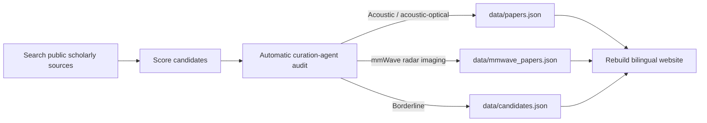

<div align='center'>

# Acoustic–Optics Imaging Paper Tracker

**A bilingual, scheduled, and auto-audited literature tracker for acoustic–optical imaging, acoustic coded imaging, computational acoustics, sonar imaging, acoustic holography, photoacoustic imaging, acousto-optic imaging, and millimeter-wave radar imaging.**

[](https://github.com/ruixv/acoustic-optics-imaging/actions/workflows/update-papers.yml)
[](https://github.com/ruixv/acoustic-optics-imaging/actions/workflows/link-check.yml)


[Browse the tracker](./index.html) · [Auto-reviewed updates](./updates.html) · [Verified metadata](./data/papers.json) · [mmWave track](./data/mmwave_papers.json) · [Scheduled update guide](./SCHEDULED_UPDATE.md)

</div>

---

## What this repository tracks

The literature around **sound, light, radar, and computation** is scattered across physics journals, optics journals, graphics venues, vision conferences, biomedical imaging journals, signal-processing venues, and mobile-sensing venues. This repository maintains a compact, high-confidence reading map for:

- **Acoustic–optical sensor fusion**: camera–sonar fusion, acoustic–optical neural rendering, cross-modal reconstruction.
- **Acoustic coded imaging**: coded sound fields, computational acoustic sensing, acoustic masks, wave-based imaging.
- **Acoustic imaging and sonar**: synthetic aperture sonar, coherent reconstruction, acoustic NLOS, underwater 3D reconstruction.
- **Acoustic holography and sound-field control**: phased arrays, acoustic holograms, volumetric displays, computational fabrication.
- **Photoacoustic and acousto-optic imaging**: photoacoustic tomography, all-optical ultrasound detection, acousto-optic wavefront control.
- **Millimeter-wave radar imaging**: FMCW/MIMO-SAR reconstruction, 4D radar, radar point clouds, and mmWave 3D scene/object reconstruction.

The goal is **not** to collect every loosely related paper. The goal is to maintain a clean, readable, updateable tracker of high-signal work.

---

## Website features

| Feature | Status |
|---|---|
| Default language | English |
| Chinese mode | Title translation + Chinese highlights |
| Update cadence | Every 6 hours |
| Discovery | Crossref + arXiv public APIs |
| Audit | Automatic curation agent |
| Main promotion | High-confidence acoustic/acoustic-optical papers can be added to `data/papers.json` automatically |
| mmWave track | Dedicated `data/mmwave_papers.json` and homepage section |
| Final-version rule | Accepted arXiv papers are labeled by their final journal/conference, not by arXiv |
| Borderline items | Kept in `data/candidates.json` / `updates.html` |
| PDF policy | Open/legal sources only |

---

## Prioritized venues

| Category | Examples |
|---|---|
| Nature family | Nature, Nature Electronics, Nature Photonics, Nature Biomedical Engineering, Nature Communications, Communications Physics, Scientific Data |
| Science family | Science, Science Advances, Science Robotics, Science Translational Medicine |
| Graphics | ACM TOG, SIGGRAPH, SIGGRAPH Asia |
| Vision / ML | CVPR, ICCV, ECCV, ICLR, NeurIPS |
| Mobile / sensing | ACM MobiSys, ACM SenSys, ACM MobiCom, IEEE Transactions on Mobile Computing |
| Imaging / pattern analysis | IEEE TPAMI, IEEE TIP, IEEE TCI, IEEE TMI |
| Physics / acoustics / optics / radar | Optica, Light: Science & Applications, Physical Review family, JASA, IEEE TUFFC, IEEE radar/signal-processing venues |

---

## Repository layout

```text
.
├── index.html                         # Bilingual searchable research atlas
├── updates.html                       # Auto-reviewed candidate stream
├── paper.html                         # Dynamic per-paper detail page
├── data/
│   ├── papers.json                    # Auto-audited acoustic/acoustic-optical paper database
│   ├── focus_papers.json              # Focused acoustic-imaging and acoustic-optical papers
│   ├── mmwave_papers.json             # Dedicated millimeter-wave radar imaging track
│   ├── candidates.json                # Borderline / watchlist candidates
│   ├── watchlist.json                 # Related directions to monitor
│   └── last_update.json               # Latest scheduled update metadata
├── papers/                            # Backward-compatible redirects to paper.html?id=...
├── pdfs/                              # Open PDFs downloaded locally when available
├── scripts/
│   ├── build_site.py                  # Rebuild bilingual pages and redirects
│   ├── update_candidates.py           # Search public scholarly sources
│   ├── agent_audit.py                 # Automatic curation-agent audit and promotion
│   ├── download_pdfs.py               # Download legal/open PDFs where possible
│   ├── check_links.py                 # Validate DOI / PDF / project / code links
│   └── search_candidates.py           # Ad hoc search helper
├── .github/workflows/
│   ├── update-papers.yml              # Scheduled update every 6 hours
│   └── link-check.yml                 # Periodic link checking
├── SCHEDULED_UPDATE.md                # Automation and permission guide
└── GITHUB_SETUP.md                    # GitHub Pages and token setup
```

---

## Automatic curation policy

Each scheduled run performs this pipeline:



The audit agent evaluates topical relevance, venue/source quality, recency, duplicate status, DOI or primary-source availability, negative-topic filters, final accepted/published version availability, and legal PDF availability. High-confidence records are promoted automatically; borderline records remain visible in `updates.html` for transparency.

### arXiv / final-version rule

arXiv is treated as a preprint source, not a final venue. If an arXiv paper has an accepted or published version, the tracker records the final journal or conference as `venue` and keeps the arXiv link only as an open PDF/preprint source when useful. If no accepted/published version can be verified, the record remains `arXiv preprint`.

---

## Run locally

```bash
python3 -m http.server 8000
```

Then open:

```text
http://localhost:8000
```

---

## Run the updater locally

```bash
python scripts/update_candidates.py
python scripts/agent_audit.py
python scripts/build_site.py
```

Then commit generated changes:

```bash
git add data/papers.json data/focus_papers.json data/mmwave_papers.json data/candidates.json data/last_update.json index.html updates.html paper.html papers/*.html
git commit -m 'Update acoustic-optics paper library'
git push
```

---

## GitHub Actions schedule

The update workflow runs every 6 hours:

```yaml
schedule:
  - cron: '17 */6 * * *'
```

Required repository setting:

```text
Settings → Actions → General → Workflow permissions → Read and write permissions
```

The workflow uses the built-in `GITHUB_TOKEN` with:

```yaml
permissions:
  contents: write
```

---

## Public-language policy

This is a public repository. Metadata should use neutral project language only. Do not include private research plans, private preferences, or notes tied to a specific user's unpublished project context.

PDF links should point only to open or legitimate sources such as publisher OA pages, arXiv, PMC, CVF, institutional repositories, or author pages.

---

<div align='center'>

**Sound × Light × Radar × Computation**  
A compact reading map for acoustic–optical and wave-based imaging research.

</div>
